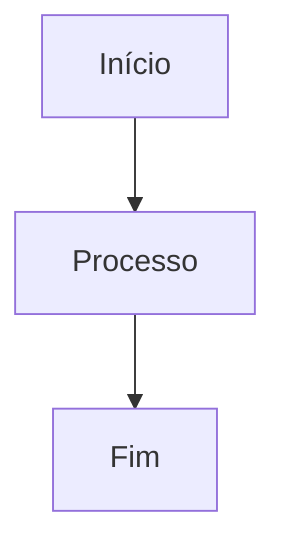
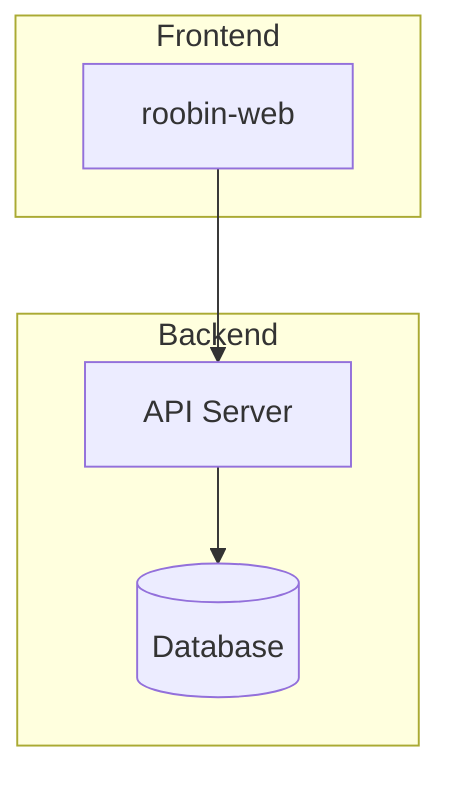
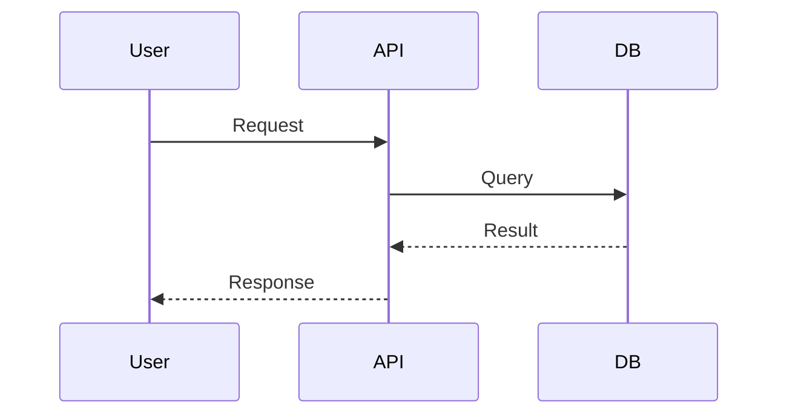
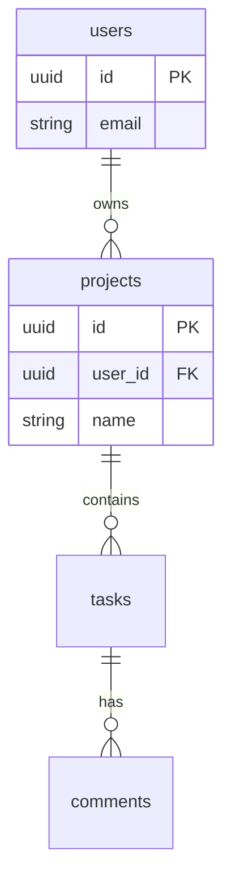
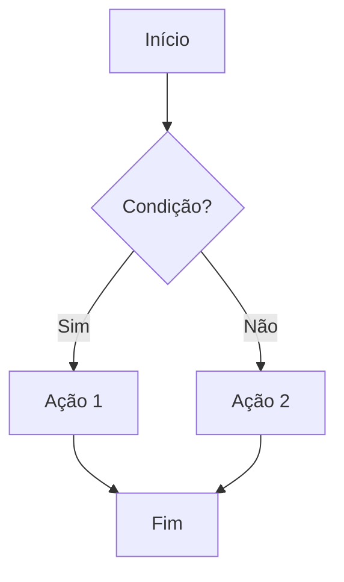

# Roobin Docs

## Overview

Criação e atualização de documentação de features no Roobin MCP.

**Core principle:** Sempre versionar antes de atualizar. Sempre publicar direto. Inferir tipo pelo contexto.

**Announce at start:** "Estou usando roobin-docs para [criar/atualizar] a documentação."

## The Iron Laws

```
SEMPRE VERSIONAR ANTES DE UPDATE
SEMPRE PUBLICAR DIRETO (status: published)
PERGUNTAR SOBRE DOC AO FINALIZAR FEATURE
BUSCAR DOC EXISTENTE AO FINALIZAR BUG
```

## When to Use

- ✓ Ao finalizar task de feature/improvement → perguntar se quer documentar
- ✓ Ao finalizar task de bug → buscar doc relacionada e perguntar se quer atualizar
- ✓ Usuário menciona "documentar", "doc", "atualizar documentação"
- ✗ Não use para gerenciamento de tasks (use roobin-tasks)

## Common Rationalizations That Mean You're About To Fail

- "Não precisa documentar, é feature pequena" → ERRADO. Pergunte ao usuário.
- "Vou atualizar sem versionar" → ERRADO. Sempre crie versão antes.
- "Vou criar como draft" → ERRADO. Publique direto.
- "Sei qual template usar" → ERRADO. Infira pelo contexto ou pergunte.

---

## Configuração

### Projeto e Usuário
Obter `project_id` e `user_id` do CLAUDE.md do projeto atual. Se não existir, perguntar ao usuário ou listar projetos com `list_projects()`.

### Defaults
| Campo | Default |
|-------|---------|
| `status` | `"published"` |
| `author` | `"Agent AI"` |
| `is_pinned` | `false` |

---

## Gatilhos Automáticos

### 1. Ao finalizar task de feature/improvement

```
✓ Task "Implementar dark mode" → review

ℹ Quer documentar essa feature? (s/n)
```

### 2. Ao finalizar task de bug

```
✓ Task "Corrigir erro no dark mode" → done

ℹ Encontrei documentação existente: "Dark Mode" (spec)
ℹ Quer atualizar a documentação? (s/n)
```

---

## Tipos de Documento

| Tipo | Quando usar | Template |
|------|-------------|----------|
| `spec` | Especificação técnica detalhada | [templates/spec.md](templates/spec.md) |
| `guide` | Guia de uso para usuários/devs | [templates/guide.md](templates/guide.md) |
| `api` | Documentação de endpoints/API | [templates/api.md](templates/api.md) |
| `technical` | Doc técnica de arquitetura | [templates/technical.md](templates/technical.md) |
| `prp` | Product Requirements Plan | [templates/prp.md](templates/prp.md) |
| `design` | Decisões de design/UX | - |
| `note` | Anotações gerais | - |
| `meeting_notes` | Atas de reunião | - |
| `business` | Documentação de negócio | - |

### Inferência Automática de Tipo

| Contexto da task | Tipo inferido |
|------------------|---------------|
| Feature de UI/UX | `guide` |
| Feature de API/backend | `api` ou `technical` |
| Feature de arquitetura | `technical` |
| Feature de design | `design` |
| Planejamento/requisitos | `prp` |
| Default | `spec` |

---

## Fluxo de Trabalho

### Criar Documentação

1. Anunciar uso da skill
2. Obter project_id do CLAUDE.md ou perguntar
3. Inferir tipo ou perguntar ao usuário
4. Carregar template apropriado de [templates/](templates/)
5. Preencher template com informações da feature
6. Criar documento com status `published`

### Atualizar Documentação

1. Anunciar uso da skill
2. Buscar documento existente
3. **CRIAR VERSÃO** antes de modificar
4. Atualizar documento
5. Confirmar mudanças

---

## Versionamento

### Regra: SEMPRE criar versão antes de update

```
✓ Versão 3 criada: "Atualização após correção de bug no login"
✓ Documento "Sistema de Autenticação" atualizado
```

---

## Integração com roobin-tasks

A skill `roobin-tasks` deixa contexto quando finaliza task:
- Título da task
- Tipo da task (feature, bug, improvement)
- Status final (review, done)

A skill `roobin-docs` lê esse contexto e:
1. Se `type: feature/improvement` → Pergunta se quer documentar
2. Se `type: bug` → Busca doc relacionada e pergunta se quer atualizar

---

## Formato de Output

### Criação
```
✓ Documentação criada:
  - [doc-123] {Título}
  - Tipo: {type} | Status: published
  - Seções: {lista de seções principais}
```

### Atualização
```
✓ Versão 3 salva: "{change_summary}"
✓ Documentação atualizada:
  - [doc-123] {Título}
  - Mudanças: {resumo das alterações}
```

### Busca
```
ℹ Documentação encontrada para "{feature}":
  - [doc-123] {Título} (spec, v3)
  - Última atualização: {data}
```

---

## Diagramas Mermaid

O Roobin suporta diagramas Mermaid renderizados visualmente nos documentos. **Use sempre que documentar arquitetura, fluxos, ou design system.**

### Sintaxe Básica

Envolver código Mermaid em bloco de código com linguagem `mermaid`:

````

````

### Tipos de Diagrama Recomendados

| Tipo | Uso | Exemplo |
|------|-----|---------|
| `graph TD` | Fluxos verticais (top-down) | Arquitetura de componentes |
| `graph LR` | Fluxos horizontais (left-right) | Pipelines, CI/CD |
| `sequenceDiagram` | Interações entre sistemas | Fluxos de API, auth |
| `erDiagram` | Modelo de dados | Schema de banco |
| `flowchart` | Decisões e branches | Lógica de negócio |

### Exemplos por Contexto

#### Arquitetura de Sistema


#### Fluxo de Requisição


#### Modelo de Dados


#### Fluxo de Decisão


### Regras de Sintaxe Importantes

| ❌ Evitar | ✅ Usar | Motivo |
|-----------|---------|--------|
| `HOME[/home]` | `HOME[home]` | `/` é operador especial |
| `Node["texto"]` | `Node[texto]` | Aspas só se necessário |
| `A --> B (info)` | `A --> B` | Parênteses em labels causam erro |
| `subgraph "Nome"` | `subgraph Nome` | Aspas podem causar problemas |

### Quando Usar Mermaid

- ✓ Documentação de arquitetura (`technical`)
- ✓ Especificações com fluxos (`spec`)
- ✓ Documentação de API com sequências (`api`)
- ✓ Design system e componentes (`design`)
- ✓ Qualquer doc que beneficie de visualização

### Temas

O Mermaid renderiza automaticamente no tema correto (dark/light) baseado no tema do Roobin.

---

## Tools MCP Roobin

| Ação | Tool |
|------|------|
| Buscar | `search_documents(project_id, query/document_id)` |
| Criar | `manage_document(action="create", project_id, title, content, document_type, status, tags)` |
| Atualizar | `manage_document(action="update", project_id, document_id, ...)` |
| Versionar | `manage_version(action="create", project_id, document_id, change_summary)` |
| Ver versões | `find_versions(project_id, document_id)` |

---

## Checklist

- [ ] Anunciei uso da skill
- [ ] Obtive project_id do CLAUDE.md ou perguntei
- [ ] Inferi tipo ou perguntei ao usuário
- [ ] Usei template apropriado
- [ ] Incluí diagramas Mermaid para arquitetura/fluxos
- [ ] Versionei antes de atualizar (se update)
- [ ] Publiquei direto (status: published)
