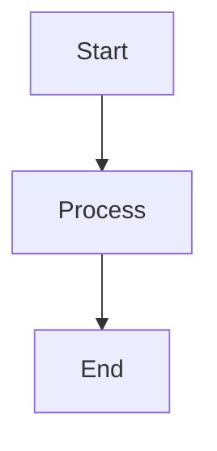
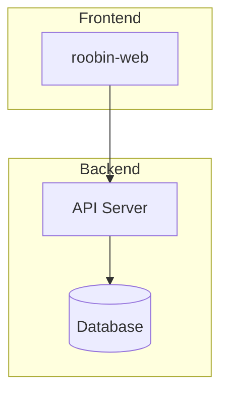
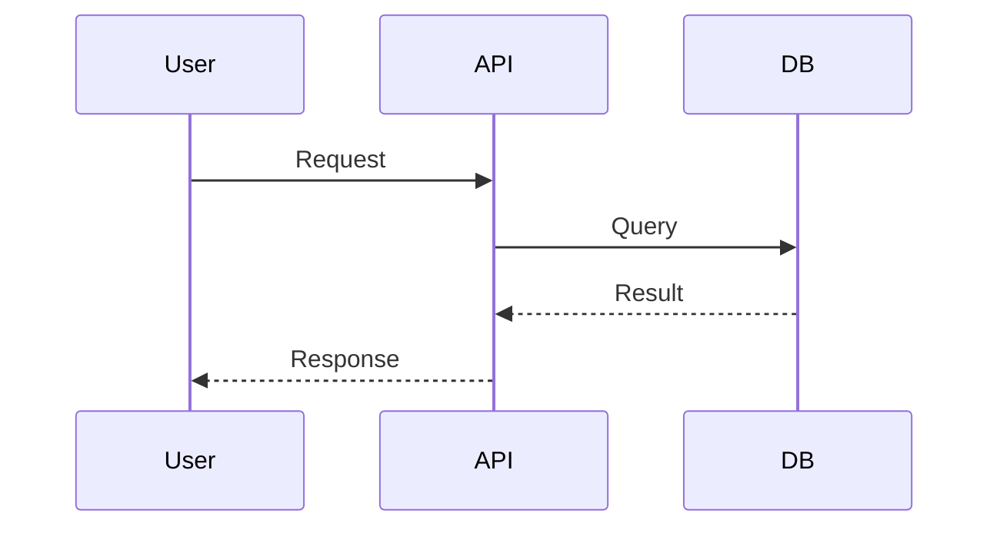
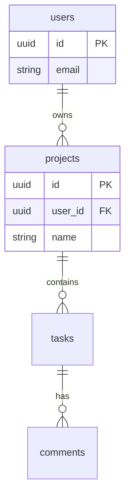
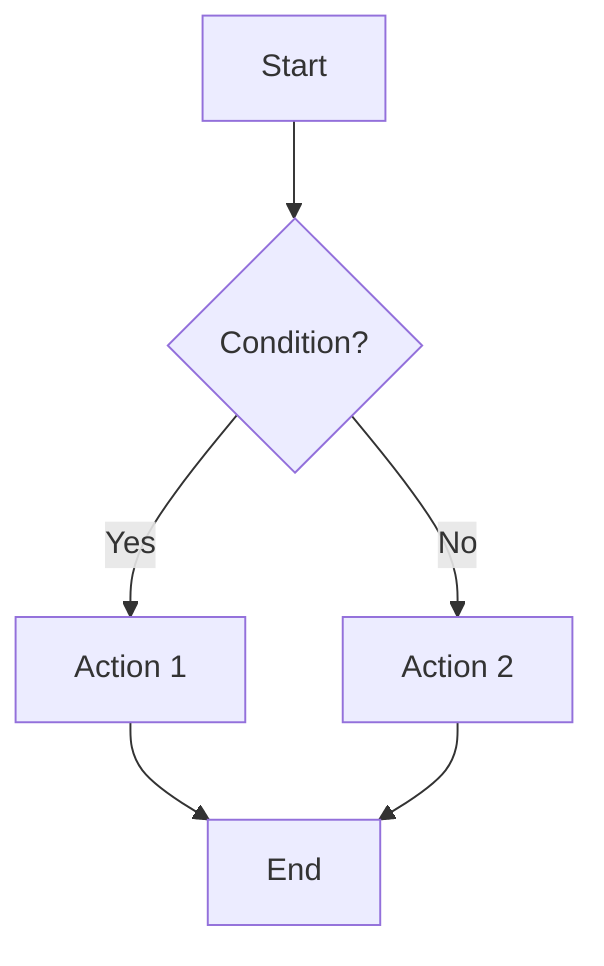

# Roobin Docs

## Overview

Create and update feature documentation in Roobin MCP.

**Core principle:** Always version before updating. Always publish directly. Infer type from context.

**Announce at start:** "I'm using roobin-docs to [create/update] the documentation."

## The Iron Laws

```
ALWAYS VERSION BEFORE UPDATE
ALWAYS PUBLISH DIRECTLY (status: published)
ASK ABOUT DOC WHEN FINISHING FEATURE
SEARCH FOR EXISTING DOC WHEN FINISHING BUG
```

## When to Use

- ✓ When finishing feature/improvement task → ask if want to document
- ✓ When finishing bug task → search for related doc and ask if want to update
- ✓ User mentions "document", "doc", "update documentation"
- ✗ Don't use for task management (use roobin-tasks)

## Common Rationalizations That Mean You're About To Fail

- "No need to document, it's a small feature" → WRONG. Ask the user.
- "I'll update without versioning" → WRONG. Always create version first.
- "I'll create as draft" → WRONG. Publish directly.
- "I know which template to use" → WRONG. Infer from context or ask.

---

## Configuration

### Project and User
Get `project_id` and `user_id` from CLAUDE.md of the current project. If not present, ask the user or list projects with `list_projects()`.

### Defaults
| Field | Default |
|-------|---------|
| `status` | `"published"` |
| `author` | `"Agent AI"` |
| `is_pinned` | `false` |

---

## Automatic Triggers

### 1. When finishing feature/improvement task

```
✓ Task "Implement dark mode" → review

ℹ Do you want to document this feature? (y/n)
```

### 2. When finishing bug task

```
✓ Task "Fix error in dark mode" → done

ℹ Found existing documentation: "Dark Mode" (guides)
ℹ Do you want to update the documentation? (y/n)
```

---

## Document Types (Folders)

Roobin organizes documents in **folders**. Use the `document_type` field to set the folder:

| Folder | Description | When to use | Template |
|--------|-------------|-------------|----------|
| `planning` | PRDs, roadmaps, strategy | Product requirements, planning | [planning.md](templates/planning.md) |
| `architecture` | ADRs, diagrams, technical decisions | Architecture, system design | [architecture.md](templates/architecture.md) |
| `specs` | Specifications, APIs, contracts | Technical specs, API documentation | [specs.md](templates/specs.md), [specs-api.md](templates/specs-api.md) |
| `guides` | Tutorials, how-tos, documentation | Usage guides, onboarding | [guides.md](templates/guides.md) |
| `research` | Analysis, findings, studies | User research, technical analysis | - |
| `quality` | Tests, QA, quality | Test plans, QA reports | - |
| `reports` | Meetings, status, reports | Minutes, status reports | - |
| `general` | Notes, misc | General notes, drafts | - |

### Automatic Folder Inference

| Task context | Inferred folder |
|--------------|-----------------|
| UI/UX feature | `guides` |
| API/backend feature | `specs` |
| Architecture feature | `architecture` |
| Planning/requirements | `planning` |
| Tests/QA | `quality` |
| Research/analysis | `research` |
| Meeting/status | `reports` |
| Default | `general` |

---

## Workflow

### Create Documentation

1. Announce skill usage
2. Get project_id from CLAUDE.md or ask
3. Infer type or ask user
4. Load appropriate template from [templates/](templates/)
5. Fill template with feature information
6. Create document with status `published`

### Update Documentation

1. Announce skill usage
2. Search for existing document
3. **CREATE VERSION** before modifying
4. Update document
5. Confirm changes

---

## Versioning

### Rule: ALWAYS create version before update

```
✓ Version 3 created: "Update after login bug fix"
✓ Document "Authentication System" updated
```

---

## Integration with roobin-tasks

The `roobin-tasks` skill leaves context when finishing a task:
- Task title
- Task type (feature, bug, improvement)
- Final status (review, done)

The `roobin-docs` skill reads this context and:
1. If `type: feature/improvement` → Ask if want to document
2. If `type: bug` → Search for related doc and ask if want to update

---

## Output Format

### Creation
```
✓ Documentation created:
  - [doc-123] {Title}
  - Type: {type} | Status: published
  - Sections: {list of main sections}
```

### Update
```
✓ Version 3 saved: "{change_summary}"
✓ Documentation updated:
  - [doc-123] {Title}
  - Changes: {summary of changes}
```

### Search
```
ℹ Documentation found for "{feature}":
  - [doc-123] {Title} (specs, v3)
  - Last updated: {date}
```

---

## Mermaid Diagrams

Roobin supports Mermaid diagrams rendered visually in documents. **Always use when documenting architecture, flows, or design system.**

### Basic Syntax

Wrap Mermaid code in a code block with `mermaid` language:

````

````

### Recommended Diagram Types

| Type | Use | Example |
|------|-----|---------|
| `graph TD` | Vertical flows (top-down) | Component architecture |
| `graph LR` | Horizontal flows (left-right) | Pipelines, CI/CD |
| `sequenceDiagram` | System interactions | API flows, auth |
| `erDiagram` | Data model | Database schema |
| `flowchart` | Decisions and branches | Business logic |

### Examples by Context

#### System Architecture


#### Request Flow


#### Data Model


#### Decision Flow


### Important Syntax Rules

| ❌ Avoid | ✅ Use | Reason |
|----------|--------|--------|
| `HOME[/home]` | `HOME[home]` | `/` is a special operator |
| `Node["text"]` | `Node[text]` | Quotes only if necessary |
| `A --> B (info)` | `A --> B` | Parentheses in labels cause errors |
| `subgraph "Name"` | `subgraph Name` | Quotes can cause issues |

### When to Use Mermaid

- ✓ Architecture documentation (`architecture`)
- ✓ Specifications with flows (`specs`)
- ✓ API documentation with sequences (`specs`)
- ✓ Guides with user flows (`guides`)
- ✓ Any doc that benefits from visualization

### Themes

Mermaid automatically renders in the correct theme (dark/light) based on the Roobin theme.

---

## Roobin MCP Tools

| Action | Tool |
|--------|------|
| Search | `mcp__roobin__search_documents` |
| Create | `mcp__roobin__manage_document` (action: create) |
| Update | `mcp__roobin__manage_document` (action: update) |
| Version | `mcp__roobin__manage_version` (action: create) |
| View versions | `mcp__roobin__find_versions` |

### manage_document Parameters

```yaml
mcp__roobin__manage_document:
  action: "create"  # create | update | delete
  project_id: "{project_id}"
  title: "Document title"
  content:
    markdown: |
      # Content in markdown

      Supports rich blocks:
      - <toggle title="...">content</toggle>
      - <callout type="info|warning|tip|error">content</callout>
      - <quote author="..." source="...">content</quote>
      - <embed url="..."/>
  document_type: "specs"  # planning|architecture|specs|guides|research|quality|reports|general
  status: "published"     # draft|published|archived
  tags: ["tag1", "tag2"]
  is_pinned: false
```

### search_documents Parameters

```yaml
mcp__roobin__search_documents:
  project_id: "{project_id}"
  query: "search term"           # search by title/content
  document_id: "{document_id}"   # direct search by ID
  document_type: "specs"         # filter by folder
```

---

## Checklist

- [ ] Announced skill usage
- [ ] Got project_id from CLAUDE.md or asked
- [ ] Inferred type or asked user
- [ ] Used appropriate template
- [ ] Included Mermaid diagrams for architecture/flows
- [ ] Versioned before updating (if update)
- [ ] Published directly (status: published)
